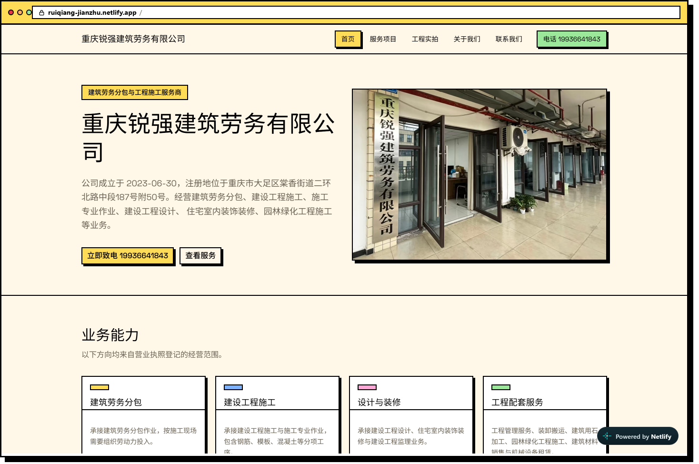
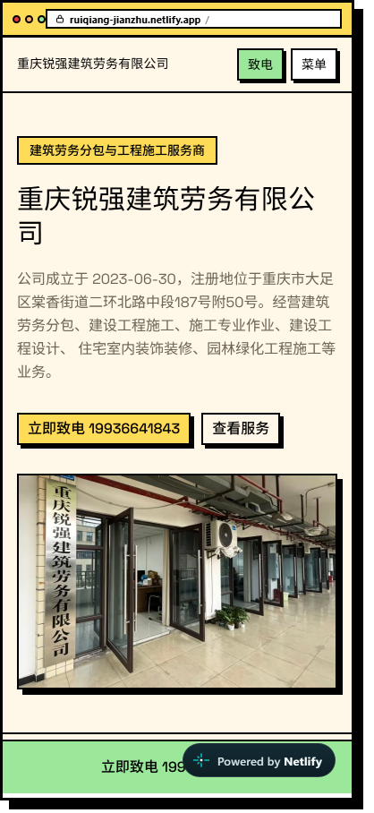
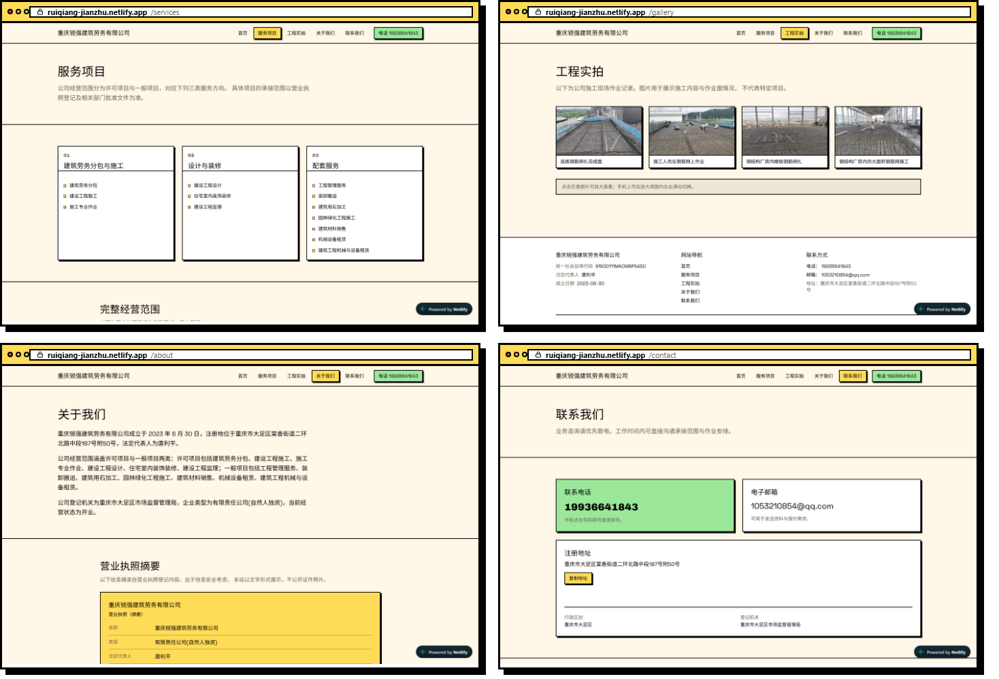

<div align="center">

# 重庆锐强建筑劳务有限公司 · 官网

**一个纯静态、零后端的 Next.js 企业官网**
建筑劳务分包 · 建设工程施工 · 施工专业作业

[](https://nextjs.org)
[](https://react.dev)
[](https://www.typescriptlang.org)
[](https://tailwindcss.com)
[](#测试)
[](./LICENSE)

**🌐 在线访问 · [https://ruiqiang-jianzhu.netlify.app](https://ruiqiang-jianzhu.netlify.app/)**

</div>

---

## 线上实拍

线上地址：**[https://ruiqiang-jianzhu.netlify.app](https://ruiqiang-jianzhu.netlify.app/)** —— 下列截图即该地址的真实页面。

<div align="center">
  <a href="https://ruiqiang-jianzhu.netlify.app/">
    
  </a>
  <br>
  <sub><b>首页 · 桌面 1440px</b> —— 点图直达 <a href="https://ruiqiang-jianzhu.netlify.app/">ruiqiang-jianzhu.netlify.app</a></sub>
</div>

<div align="center">
  <a href="https://ruiqiang-jianzhu.netlify.app/">
    
  </a>
  <br>
  <sub><b>首页 · 手机 390px</b> —— 汉堡菜单 + 底部悬浮致电条</sub>
</div>

<div align="center">
  <a href="https://ruiqiang-jianzhu.netlify.app/">
    
  </a>
  <br>
  <sub><b>内页 4 张</b> —— /services · /gallery · /about · /contact</sub>
</div>

截图由本机 headless Chrome **实际访问线上地址逐页拍摄**
（脚本 [`scripts/capture-readme-shots.mjs`](./scripts/capture-readme-shots.mjs)，
随时可用 `npm run shots:readme` 重拍），页面内容为原始截图，未做任何美化。

两处需要说清楚的边界：

- **窗口外框与地址栏是合成的。** CDP 截图只能拿到页面内容，拿不到浏览器自身的
  标签栏/地址栏，所以外框由脚本按本站设计令牌（`--border: #000`、`--radius: 0`、
  硬偏移阴影、品牌黄）用 HTML 渲染合成。地址栏里的域名就是上面这个线上域名，
  与 `lib/site.ts` 的 `PRODUCTION_SITE_URL` 同源，换域名只需改一处。
- **图右下角的 `Powered by Netlify` 角标是真的。** 那是 Netlify 免费套餐按访客所见
  注入的角标，不是后期贴上去的——这里选择保留它，而不是修图抹掉。

> 只截首屏（桌面 1440×900 / 手机 390×844，与 `npm run test:probes` 的探测视口一致），
> 不做整页长图：README 里的图应该能被一眼看完，而不是让人滚一分钟。

## 这个项目有什么不一样

这不是一个套模板改文案的官网。「内容真实性」和「合规」在本项目里是被**测试强制守住**的硬约束，
而不是写在文档里靠自觉的君子协定：

- **不编造任何企业事实。** 全站文案的每一个事实都必须能回溯到工商登记材料或项目原始素材。
  测试里有一张禁止词表（`承接过` / `已完成项目` / `众多客户` / `深耕多年` 之类），
  命中即删，且这张表**自身也有自检测试**（确保每条规则不是永远匹配不到的废规则）。
- **证件照永不发布。** 营业执照照含统一社会信用代码与法定代表人姓名。
  它不仅在 `public/` 下不存在，在构建管线的 `BLOCKED` 名单里被**显式拒绝并 `exit 2`**——
  即使有人把它塞进派生白名单，构建也会主动终止。
- **181 条测试覆盖到「产物层」。** 不只测组件渲染，还测构建产物里的
  `` 是否真的带上了 `fetchpriority`、每个页面是否静态生成，
  以及 `canonical` / `og:url` / `og:image` / `sitemap.xml` / `robots.txt`
  里的 URL 是否是**线上域名而不是 `localhost`**。
  最后这条不是修辞：本站上线后曾经整站 SEO 元数据都指向 `http://localhost:3000`
  （canonical、og:url、sitemap、robots 全中），而页面看起来完全正常。
  当时的断言之所以没抓到，是因为它只把产物与"同一进程里算出的 `SITE_URL`"
  比对 —— 体检与病灶出自同一个值，于是恒真。现在的断言改为对**绝对事实**判定。
- **源码层零平台锁定。** `next.config.ts` 不绑定任何平台，没有 `output: "export"`，
  没有 Route Handler，没有平台专属环境变量。仓库里只有一份 `netlify.toml`
  声明 Next 运行时插件（增量配置，不绑定源码）——换平台只需增删这一个文件。

## 设计

站点图标是「戴安全帽的 R」：用锐强拼音首字母构成钢梁般的粗体轮廓，配以安全帽、品牌黄和硬阴影。SVG 源稿位于 `public/brand/ruiqiang-mark.svg`；运行 `npm run icons` 可重建 16/32/48px favicon、512px 品牌图与 180px Apple 主屏幕图标。

**Neobrutalism** —— 粗黑描边、硬阴影、高饱和撞色。建筑劳务是个重体力的行当，
界面不做玻璃拟态那套轻飘飘的东西，用实心的块与线，信息层级靠边框和留白拉出来。

字体走中文优先：拉丁字形用 Archivo Black（标题）/ Space Grotesk（正文），
汉字用 Noto Sans SC 的 400 / 500 / 900 三个字重，全部由 `next/font` 在**构建期**
自托管到本站（不外链 Google 的 CDN），并靠 `unicode-range` 子集化把每个字重切成
上百个分片 —— 浏览器只下载页面实际用到的那几片，所以中文面设了 `preload: false`。
字体未就绪时由 `display: "swap"` + `globals.css` 里的 CJK 兜底链
（PingFang SC / Microsoft YaHei 等）先顶上，不会出现隐形文字。

## 页面

| 路由 | 内容 |
| --- | --- |
| `/` | 首屏、业务概览、工程实拍、联系方式 |
| `/services` | 经营范围（许可项目 / 一般项目逐字展示）+ 营业执照摘要 |
| `/gallery` | 工程实拍相册，含键盘可操作的灯箱 |
| `/about` | 公司简介、工商登记信息表（15 个字段） |
| `/contact` | 电话 / 邮箱 / 地址、可复制地址、地图外链 |
| `/sitemap.xml` `/robots.txt` | 构建期生成的静态文件 |
| `/_not-found` | 中文 404（含站内导航；Next 自动注入 `noindex`，返回真实 404 状态码） |

响应式三档（与探测脚本的实测数值一致）：

| 宽度 | 表现 |
| --- | --- |
| `<768px`（手机） | 底部悬浮致电条 + 汉堡菜单 |
| `768–1023px`（平板） | 无悬浮条；仍是汉堡菜单（公司全称 + 5 项导航 + 电话在 768px 下会拆行，故导航到 `lg` 才展开） |
| `≥1024px`（桌面） | 导航与电话全部展开，无悬浮条 |

## 快速开始

```bash
# 需要 Node.js 20.9+（本项目在 Node 22 上开发）
npm install
npm run dev          # http://localhost:3000
```

### 常用脚本

```bash
npm run dev              # 开发服务器
npm run build            # 生产构建
npm run start            # 跑生产构建（需先 build）
npm test                 # 复核当前构建及其报告；缺失、旧报告均失败
npm run verify           # 发布门禁：lint + 构建 + 类型检查 + 三组浏览器探测 + 全部断言
npm run typecheck        # tsc --noEmit
npm run lint             # eslint
npm run images           # 重建 public/images/ 派生品（见下方说明）
npm run shots:readme     # 重拍 README 的线上实拍图（headless Chrome 访问线上地址）
```

## 测试

```bash
npm run verify
```

9 个测试文件、181 条断言：

| 层 | 文件 | 职责 |
| --- | --- | --- |
| 源码层 | `tests/pages.test.ts` | 文案纪律、禁止词表自检、图片键与产物对应 |
| 元数据层 | `tests/seo.test.ts` | 逐页 title/description 唯一性、canonical/og、JSON-LD 负向断言 |
| 环境契约层 | `tests/deploy.test.ts` | 站点绝对 URL 的解析契约、平台锁定、合规闸门 |
| 产物层 | `tests/theme.test.ts`、`tests/images.test.ts` | 编译后 CSS 的圆角/阴影真实数值、图片派生管线幂等 |
| 浏览器探测层 | `tests/responsive.test.ts`、`tests/map.test.ts` | 三档响应式、交互态（灯箱/汉堡菜单/悬浮条）、地图外链 |
| 验收身份层 | `tests/probe-contract.test.ts` | 拒绝旧报告、错构建、源码变化、空报告；强制覆盖新增回归场景 |

> `tests/deploy.test.ts`、`tests/pages.test.ts`、`tests/seo.test.ts`、`tests/theme.test.ts`
> 的部分断言读 `.next/` 下的构建产物；完整验收请运行 **`npm run verify`**，它会重新构建并生成三份浏览器报告。
> 测试读的是构建结果而不是重新编译的源码——这正是它们能抓到
> 「源码写了但产物里没有」这类静默回归的原因。

### 关于浏览器探测（`npm run test:probes`）

`tests/responsive.test.ts` 读的是 `tests/probe-out/` 下的探测报告，而那个目录靠
**真的启动 headless Chrome 去点、去滑、去量**才会产出，且已被 `.gitignore` 排除。

因此：

- **`npm test`** —— 复核当前源码、构建与报告；缺报告、身份不匹配、空报告均失败，不跳过浏览器套件。
- **`npm run verify`** —— lint → 标准生产构建 → 类型检查 → 启动服务 → 三组浏览器探测 → 全部断言。报告绑定源码指纹、BUILD_ID、运行 ID 和目标地址；任一步失败阻止发布。
- 浏览器可用本机 Chrome / Edge（`CHROME_PATH`），或先执行 `npx playwright install --with-deps chromium`。GitHub Actions 和 Netlify 均运行完整门禁。
- Netlify 使用 `npm run verify:netlify`：在临时目录解压 Chromium 及其运行库，无需 root 或 apt；然后调用同一个 `npm run verify`。GitHub 同时验证系统浏览器与打包浏览器两种环境。
- 新回归测试覆盖 375/390/767px × 五页的致电入口实际命中、延迟注入角标后的布局、页脚可见性，以及 768→1024→768px 菜单与滚动恢复。独立线上检查使用真实角标，不注入测试夹具。

## 图片管线

`public/images/` 下的派生品由 `scripts/build-images.mjs` 从 `img/` 生成，
不是手工放进去的。白名单式设计：只有登记过的语义 key 会产出派生品，
且 `BLOCKED` 名单**优先于**白名单。

```bash
npm run images           # webp + avif，各 1600/800 两档，单图 < 300 KB
```

> ⚠️ **本仓库不含营业执照照与工商登记摘要源文件**（含敏感工商信息，见
> [`PLACEHOLDERS.md`](./PLACEHOLDERS.md) §7）。图片管线只读取公开白名单源图，不依赖证件原图。
> 可公开的 4 张工程实拍与门头原图保留入库，派生链可在全新克隆中重建。图片禁发测试使用临时合成素材，不需要真实证件原图。

## 部署

线上地址：**[https://ruiqiang-jianzhu.netlify.app](https://ruiqiang-jianzhu.netlify.app/)**（Netlify + Git 集成）。

`netlify.toml` 声明 Next 运行时插件、完整发布验收和静态资源缓存策略；
`next.config.ts` 配置安全响应头。移动端样式仅在 Netlify 角标实际存在时为其预留空间，换托管平台不会留下空白：

```toml
[build]
  command = "npm run verify:netlify"
  publish = ".next"

[[plugins]]
  package = "@netlify/plugin-nextjs"
```

接站只需把 GitHub 仓库连到 Netlify（需在浏览器完成 GitHub App 授权，
这是 CLI/API 绕不过的一步），`netlify.toml` 会被自动读取。

> **不要**给 `next.config.ts` 加 `output: "export"`。那会让 App Router 的
> 路由分发退化成静态直传，并要求 `images.unoptimized: true`。
> `tests/deploy.test.ts` 里有断言钉住这一点。
>
> ⚠️ 本机 `netlify deploy --build` 会撞上沙箱的 safe-delete 守卫，**不要用**。
> Next.js 项目走 Git 集成（云端构建）才是正路。

### 部署环境变量：**不需要设置任何变量**

站点绝对 URL 以常量内置在 `lib/site.ts` 的 `PRODUCTION_SITE_URL`：

```ts
export const PRODUCTION_SITE_URL = "https://ruiqiang-jianzhu.netlify.app";
```

解析规则（`resolveSiteUrl`，见 `lib/site.ts`）：

| 情况 | 结果 |
| --- | --- |
| 未设 `NEXT_PUBLIC_SITE_URL` + 生产构建 | 用 `PRODUCTION_SITE_URL` |
| 未设 + 开发 / 测试 | `http://localhost:3000` |
| 显式设了 | 用它（去空格、去尾斜杠） |
| 显式设了，但**不是干净的 https 主机名**（http / localhost / 带路径或查询串） | **构建直接失败** |

> **为什么改成这样（这是一次真实事故的修复）。** 早先 `SITE_URL` 只认环境变量、
> 缺失时静默回落 `localhost`。上线后 Netlify 侧没配上，于是线上的
> `canonical`、`og:url`、`og:image`、`sitemap.xml`、`robots.txt` **全部**指向
> `http://localhost:3000` —— 搜索引擎被指向一个不存在的域名，微信分享没有封面图，
> sitemap 上报了 5 个死链，而页面本身看起来完全正常。
>
> 所以现在的策略是"漏配也正确、配错就报错"：换域名只改 `PRODUCTION_SITE_URL` 一处；
> 确有需要（如 staging）时才设 `NEXT_PUBLIC_SITE_URL`，且必须是 https 绝对地址。
>
> **验收方式**：访问 `/sitemap.xml`，`<loc>` 必须是线上域名而非 `localhost`。
> 完整的部署手册见 [`DEPLOY.md`](./DEPLOY.md)，构建侧验收报告见 [`VERIFY_DEPLOY.md`](./VERIFY_DEPLOY.md)。

## 项目文档

| 文件 | 内容 |
| --- | --- |
| [`PRD.md`](./PRD.md) | 产品需求，含合规硬约束与素材清单 |
| [`DEVELOPMENT_PLAN.md`](./DEVELOPMENT_PLAN.md) | A0–A8 开发计划与每阶段出口判据 |
| [`TASKS.md`](./TASKS.md) | 任务清单与逐项验收记录 |
| [`DEPLOY.md`](./DEPLOY.md) | Netlify 部署手册与故障排查 |
| [`PLACEHOLDERS.md`](./PLACEHOLDERS.md) | 待替换值台账、不进库文件清单、规格偏差记录 |
| [`docs/screenshots/`](./docs/screenshots/) | README 线上实拍图与拍摄清单（`npm run shots:readme` 重拍） |

## 已知边界

- **地图不含精确坐标。** 注册地址的经纬度在现有材料中无出处，因此**刻意留空**，
  走的是「把完整地址交给图商做关键词检索」的路线——标点位置由图商解析，
  不存在「我们标错了」的风险。一个错误的地图标点比没有标点更糟。
- **ICP 备案号未展示。** 境外托管无需备案，当前也无备案信息，故不渲染空模块。
- **无客户评价 / 项目业绩 / 资质荣誉模块。** 材料中没有这些事实，按纪律不建模块、不编造。

## 许可

[MIT](./LICENSE)

